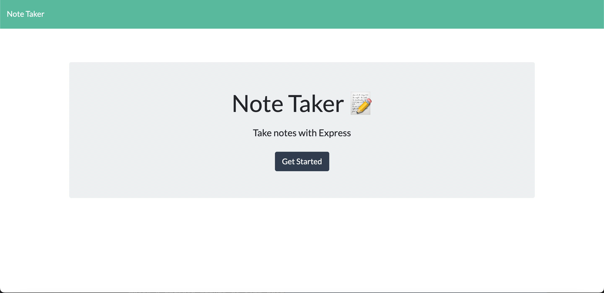
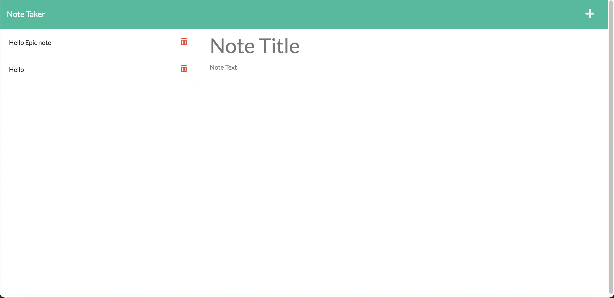

   <h1 align ="center">Note Taker<h1>

## Description
Application in which users can create, edit, save and delete notes for best use name each note with something that is easy to recall. 
 

 

 
Here is a Demonstration of the application:
 
[demo]()
 

# Table of Contents
* [Description](#description)
* [Technologies](#technologies)
* [Installation](#installation)
* [License](#license)
* [Contributions](#contributions)
* [Github](#github)

## Technologies

<li>Js</li>
<li>CSS</li>
<li>HTML</li>
<li>NodeJs</li>

## Installation
npm i

## License

 
This Project is licensed under the MIT license.

## Contributions
Yahir F

## Github
Questions? 
Contact me through my github 
 
[Github](https://github.com/Yahir-F): Yahir-F
 

Email: placeholder@gmail.com

    